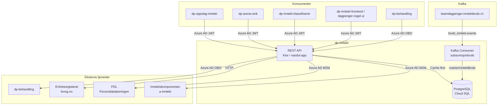
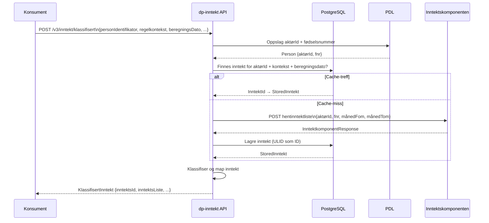

# dp-inntekt — Arkitektur og integrasjoner

## Hva er dp-inntekt?

`dp-inntekt` er en **cache-tjeneste for inntektsopplysninger** i dagpenger-domenet. Tjenesten henter inntektsdata fra Inntektskomponenten (a-inntekt), lagrer dem i en PostgreSQL-database og eksponerer dem til dagpenger-regelmotor og saksbehandlingsverktøy.

**Formål:**
- Unngå gjentatte kall til Inntektskomponenten for samme beregning
- Gjøre inntektsdata tilgjengelig for regelkjøring med konsistente, reproduserbare resultater
- Støtte manuell redigering av inntektsdata for saksbehandlere

---

## Systemdiagram



---

## Kjerneflyt: henting av inntekt

Når en konsument ber om inntekt for en person og en beregningsdato, følger tjenesten denne flyten:



### Manuell redigering

Saksbehandlere kan redigere inntektsopplysninger via `dp-inntekt-frontend`. Redigeringer lagres i databasen og markeres med hvem som redigerte og tidspunkt. Klassifisert inntekt returnerer `manueltRedigert: true` og eventuell begrunnelse.

---

## API-oversikt

Alle endepunkter krever **Azure AD JWT** i `Authorization: Bearer`-header (unntatt `/v1/inntekt` som er uauthentisert for bakoverkompatibilitet).

### v3 (anbefalt)

| Metode | Endepunkt | Beskrivelse |
|--------|-----------|-------------|
| `POST` | `/v3/inntekt/klassifisert` | Hent klassifisert og cachet inntekt for en person og periode |
| `POST` | `/v3/inntekt/harInntekt` | Sjekk om en person har inntekt i en gitt måned (direkte fra a-inntekt, ikke cachet) |
| `GET`  | `/v3/inntekt/inntektId/{aktørId}/{kontekstType}/{kontekstId}/{beregningsDato}` | Hent intern inntektId for et sett Arena-parametere |

**Request-eksempel `POST /v3/inntekt/klassifisert`:**
```json
{
  "personIdentifikator": "12345678901",
  "regelkontekst": {
    "id": "vedtak-123",
    "type": "vedtak"
  },
  "beregningsDato": "2024-01-15",
  "periodeFraOgMed": "2021-01",
  "periodeTilOgMed": "2023-12"
}
```

### v2

| Metode | Endepunkt | Beskrivelse |
|--------|-----------|-------------|
| `POST` | `/v2/inntekt/klassifisert` | Hent klassifisert inntekt (eldre format) |
| `GET`  | `/v2/inntekt/klassifisert/{inntektId}` | Hent klassifisert inntekt etter ID |
| `GET`  | `/v2/inntekt/verdikoder` | Hent alle gyldige verdikoder for inntektskategorier |

### v1 (legacy)

| Metode | Endepunkt | Beskrivelse |
|--------|-----------|-------------|
| `GET`  | `/v1/inntekt/uklassifisert/{aktørId}/{kontekstType}/{kontekstId}/{beregningsDato}` | Hent uklassifisert (rå) inntekt fra cache |
| `POST` | `/v1/inntekt/uklassifisert/{aktørId}/{kontekstType}/{kontekstId}/{beregningsDato}` | Lagre manuelt redigert inntekt |
| `GET`  | `/v1/inntekt/uklassifisert/{inntektId}` | Hent uklassifisert inntekt etter ID (med metadata) |
| `POST` | `/v1/inntekt/uklassifisert/{inntektId}` | Oppdater inntekt etter ID (manuell redigering) |
| `GET`  | `/v1/inntekt/uklassifisert/uncached/{aktørId}/...` | Hent direkte fra Inntektskomponenten, omgå cache |
| `GET`  | `/v1/inntekt/verdikoder` | Hent alle gyldige verdikoder |
| `POST` | `/v1/samme-inntjeningsperiode` | Sjekk om to beregningsdatoer deler samme opptjeningsperiode |
| `GET`  | `/v1/enhetsregisteret/enhet/{orgnummer}` | Oppslag på virksomhet i Enhetsregisteret |

---

## Integrasjoner

### Inntektskomponenten (a-inntekt)
- **Formål:** Kilde til alle inntektsopplysninger (lønn, ytelser, næringsinntekt)
- **Protokoll:** REST/HTTP med Azure AD `client_credentials`-token
- **Mønster:** Kun kalt ved cache-miss (eller ved eksplisitt `uncached`-kall)
- **Metrikker:** `inntektskomponent_client_seconds` (latens), `inntektskomponent_fetch_error` (feilaggregering)
- **Miljø:** `dev-fss` i dev, `prod-fss` i prod (cross-cluster via pub-endpoint)

### PDL — Persondataløsningen
- **Formål:** Slå opp `aktørId` ↔ `fødselsnummer` for en person-identifikator
- **Protokoll:** GraphQL over HTTPS med Azure AD `client_credentials`-token
- **Klient:** Auto-generert fra GraphQL-skjema (`graphql-kotlin`)

### Enhetsregisteret (Brønnøysund)
- **Formål:** Hente virksomhetsinformasjon (navn, organisasjonsform) for en orgnummer
- **Protokoll:** REST/HTTP, offentlig API (ingen auth)
- **URL:** `https://data.brreg.no/enhetsregisteret`

### dp-behandling
- **Formål:** Rekjøre en behandling når inntektsopplysninger er manuelt redigert
- **Protokoll:** REST/HTTP med Azure AD **OBO-token** (on-behalf-of saksbehandlers token)
- **Endepunkt:** `POST /behandling/{behandlingId}/rekjor`
- **Merknad:** OBO brukes her fordi handlingen utføres på vegne av en saksbehandler

### Kafka — `teamdagpenger.inntektbrukt.v1`
- **Formål:** Motta hendelser om at en inntekt er blitt brukt i en regelkjøring
- **Retning:** Consumer (dp-inntekt leser, skriver ikke)
- **Event-format:**
  ```json
  {
    "@event_name": "brukt_inntekt",
    "aktorId": "...",
    "inntektsId": "01ABCDEF...",
    "kontekst": { ... }
  }
  ```
- **Effekt:** Setter `brukt = true` på inntektsraden i databasen

---

## Databasemodell

```
inntekt_v1
├── id          TEXT (ULID)     PK
├── inntekt     JSONB           Rådata fra Inntektskomponenten
├── manuelt_redigert BOOLEAN   Default false
├── brukt       BOOLEAN         Default false (satt av Kafka-consumer)
└── timestamp   TIMESTAMPTZ

inntekt_person_mapping
├── inntekt_id      FK → inntekt_v1.id
├── aktør_id        TEXT
├── fnr             TEXT
├── kontekst_id     TEXT        (regelkontekst)
├── kontekst_type   TEXT
├── beregningsdato  DATE
├── periode_fra     DATE
├── periode_til     DATE
└── timestamp       TIMESTAMPTZ

inntekt_v1_manuelt_redigert
├── inntekt_id   FK → inntekt_v1.id   PK
├── redigert_av  TEXT
├── begrunnelse  TEXT
└── timestamp    TIMESTAMPTZ
```

**Indekser:** `(aktør_id, kontekst_id, kontekst_type, beregningsdato, timestamp DESC)` for rask cache-oppslag.

---

## Bakgrunnsjobber

### Vaktmester (deaktivert)
Rydder ubrukt inntekt eldre enn 180 dager fra databasen. Kjøres som en `fixedRateTimer` hvert 12. time med 10 minutters initial forsinkelse.

> ⚠️ **Status:** Selve `rydd()`-kallet er kommentert ut i `Application.kt`. Funksjonaliteten er implementert i `Vaktmester.kt` og kan aktiveres ved behov.

---

## Autentisering og autorisasjon

| Kaller | Mekanisme | Nais-konfigurasjon |
|--------|-----------|-------------------|
| Andre Nav-tjenester (M2M) | Azure AD `client_credentials` | `azure.application.enabled: true` |
| dp-behandling (saksbehandlerkontext) | Azure AD OBO | Håndteres i `DpBehandlingKlient` |

Tillatte innkommende tjenester (definert i `accessPolicy.inbound`):
- `dp-oppslag-inntekt`
- `dp-arena-sink`
- `dp-inntekt-klassifiserer`
- `dp-inntekt-frontend`
- `dagpenger-regel-ui`
- `azure-token-generator` (kun dev)

---

## Observabilitet

| Metrikk | Type | Beskrivelse |
|---------|------|-------------|
| `inntektskomponent_client_seconds` | Summary | Latens mot Inntektskomponenten (p50, p90, p99) |
| `inntektskomponent_fetch_error` | Counter | Antall feilet kall mot Inntektskomponenten |
| `inntektskomponent_status_codes` | Counter (label: status_code) | HTTP-statuskoder fra Inntektskomponenten |
| `inntekt_slettet` | Counter | Antall inntektsrader slettet av Vaktmester |

Logging via Loki og Elastic. OpenTelemetry auto-instrumentering aktivert (`runtime: java`).

Helse-endepunkter:
- `/isalive` — PostgreSQL + Kafka-consumer oppe
- `/isready` — PostgreSQL oppe
- `/metrics` — Prometheus-metrikker

---

## Lokalt oppsett

```bash
# Start PostgreSQL
docker-compose up

# Kjør applikasjonen (main i Application.kt)
./gradlew :dp-inntekt-api:run

# Kjør tester (krever Docker)
./gradlew test
```

Se [NAIS-dokumentasjon](https://docs.nais.io/how-to-guides/persistence/postgres/#personal-database-access) for personlig tilgang til databasen i dev/prod.
