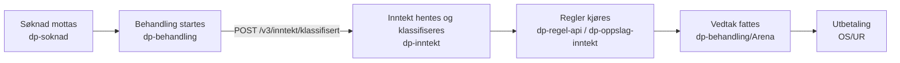
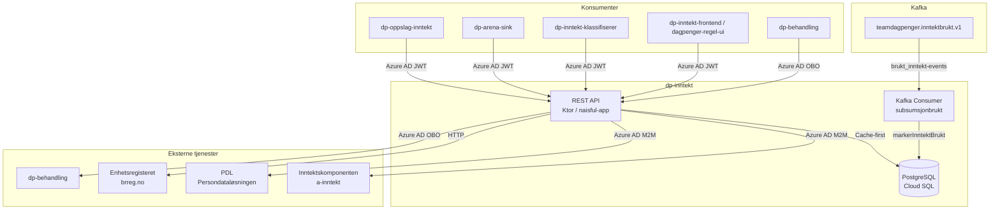
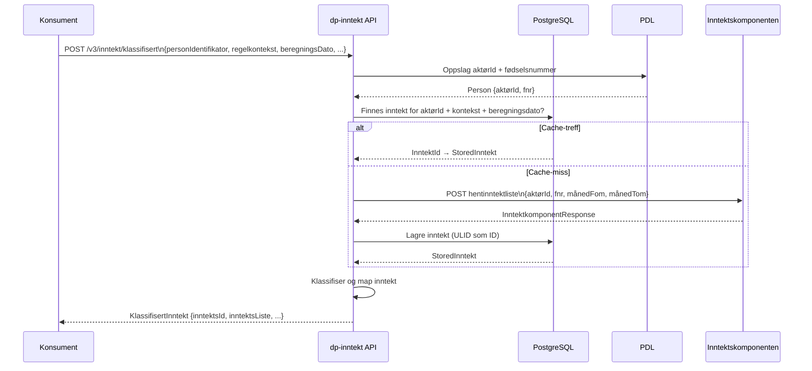

# dp-inntekt — Arkitektur og integrasjoner

## Hva er dp-inntekt?

`dp-inntekt` er en **cache-tjeneste for inntektsopplysninger** i dagpenger-domenet. Tjenesten henter inntektsdata fra Inntektskomponenten (a-inntekt), lagrer dem i en PostgreSQL-database og eksponerer dem til dagpenger-regelmotor og saksbehandlingsverktøy.

**Formål:**
- Unngå gjentatte kall til Inntektskomponenten for samme beregning
- Gjøre inntektsdata tilgjengelig for regelkjøring med konsistente, reproduserbare resultater
- Støtte manuell redigering av inntektsdata for saksbehandlere

---

## Rolle i dagpenge-verdikjeden

`dp-inntekt` er et **bakgrunnsystem uten brukergrensesnitt**. Tjenesten har ingen rolle i saksbehandling eller vedtak direkte, men er en kritisk datakilde for regelkjøring:



| Steg i verdikjeden | Ansvarlig system                  | dp-inntekt sin rolle                                             |
|--------------------|-----------------------------------|------------------------------------------------------------------|
| Søknad | `dp-soknad`                       | —                                                                |
| Behandlingsstart | `dp-behandling`                   | —                                                                |
| **Inntektsoppslag og caching** | **`dp-inntekt`**                  | **Henter fra a-inntekt ved cache-miss, returnerer `inntektsId`** |
| **Klassifisering av inntekt** | **`dp-inntekt`**                  | **Kategoriserer posteringer etter dagpengeregelverket**          |
| Regelkjøring | `dp-oppslag-inntekt` / regelmotor | Konsumerer klassifisert inntekt via `inntektsId`                 |
| Manuell redigering | `dp-inntekt-frontend`             | Kaller dp-inntekt API for å redigere cachet inntekt              |
| Vedtak og utbetaling | `dp-behandling`, Arena            | Markere inntekt som brukt                                        |

> **Merk:** dp-inntekt **prøver ikke vilkår** og fatter ingen vedtak. Vilkårsprøvingen (f.eks. om inntekten oppfyller minstekravet) skjer i regelmotoren.

---

## Systemdiagram



---

## Kjerneflyt: henting av inntekt

Når en konsument ber om inntekt for en person og en beregningsdato, følger tjenesten denne flyten:



### Manuell redigering

Saksbehandlere kan redigere inntektsopplysninger via `dp-inntekt-frontend`. Redigeringer lagres i databasen og markeres med hvem som redigerte og tidspunkt. Klassifisert inntekt returnerer `manueltRedigert: true` og eventuell begrunnelse.

---

## API-oversikt

Alle endepunkter krever **Azure AD JWT** i `Authorization: Bearer`-header (unntatt `/v1/inntekt` som er uauthentisert for bakoverkompatibilitet).

### v3 (anbefalt)

| Metode | Endepunkt | Beskrivelse |
|--------|-----------|-------------|
| `POST` | `/v3/inntekt/klassifisert` | Hent klassifisert og cachet inntekt for en person og periode |
| `POST` | `/v3/inntekt/harInntekt` | Sjekk om en person har inntekt i en gitt måned (direkte fra a-inntekt, ikke cachet) |
| `GET`  | `/v3/inntekt/inntektId/{aktørId}/{kontekstType}/{kontekstId}/{beregningsDato}` | Hent intern inntektId for et sett Arena-parametere |

**Request-eksempel `POST /v3/inntekt/klassifisert`:**
```json
{
  "personIdentifikator": "12345678901",
  "regelkontekst": {
    "id": "vedtak-123",
    "type": "vedtak"
  },
  "beregningsDato": "2024-01-15",
  "periodeFraOgMed": "2021-01",
  "periodeTilOgMed": "2023-12"
}
```

### v2

| Metode | Endepunkt | Beskrivelse |
|--------|-----------|-------------|
| `POST` | `/v2/inntekt/klassifisert` | Hent klassifisert inntekt (eldre format) |
| `GET`  | `/v2/inntekt/klassifisert/{inntektId}` | Hent klassifisert inntekt etter ID |
| `GET`  | `/v2/inntekt/verdikoder` | Hent alle gyldige verdikoder for inntektskategorier |

### v1 (legacy)

| Metode | Endepunkt | Beskrivelse |
|--------|-----------|-------------|
| `GET`  | `/v1/inntekt/uklassifisert/{aktørId}/{kontekstType}/{kontekstId}/{beregningsDato}` | Hent uklassifisert (rå) inntekt fra cache |
| `POST` | `/v1/inntekt/uklassifisert/{aktørId}/{kontekstType}/{kontekstId}/{beregningsDato}` | Lagre manuelt redigert inntekt |
| `GET`  | `/v1/inntekt/uklassifisert/{inntektId}` | Hent uklassifisert inntekt etter ID (med metadata) |
| `POST` | `/v1/inntekt/uklassifisert/{inntektId}` | Oppdater inntekt etter ID (manuell redigering) |
| `GET`  | `/v1/inntekt/uklassifisert/uncached/{aktørId}/...` | Hent direkte fra Inntektskomponenten, omgå cache |
| `GET`  | `/v1/inntekt/verdikoder` | Hent alle gyldige verdikoder |
| `POST` | `/v1/samme-inntjeningsperiode` | Sjekk om to beregningsdatoer deler samme opptjeningsperiode |
| `GET`  | `/v1/enhetsregisteret/enhet/{orgnummer}` | Oppslag på virksomhet i Enhetsregisteret |

---

## Inntektsklassifisering

Inntekt fra Inntektskomponenten klassifiseres i kategorier (se `InntektKlasse` i `dp-inntekt-kontrakter`) basert på posteringstype fra a-inntekt. Klassifiseringen er implementert i `KlassifisertPostering.kt`.

| `InntektKlasse` | Beskrivelse | Eksempel på posteringstyper |
|----------------|-------------|----------------------------|
| `ARBEIDSINNTEKT` | Lønn, bonus, feriepenger og andre lønnsinntekter | `FASTLØNN`, `BONUS`, `FERIEPENGER`, `TIMELØNN`, `OVERTIDSGODTGJØRELSE` |
| `DAGPENGER` | Dagpengeytelse fra NAV | `Y_DAGPENGER_VED_ARBEIDSLØSHET`, ferietillegg |
| `DAGPENGER_FANGST_FISKE` | Dagpenger til fisker som bare har hyre | `N_DAGPENGER_TIL_FISKER` |
| `SYKEPENGER` | Sykepenger fra NAV | `Y_SYKEPENGER`, feriepenger |
| `SYKEPENGER_FANGST_FISKE` | Sykepenger til fisker | `N_SYKEPENGER_TIL_FISKER` |
| `FANGST_FISKE` | Næringsinntekt for fiskere | `N_LOTT_KUN_TRYGDEAVGIFT`, `N_VEDERLAG` |
| `TILTAKSLØNN` | Lønn under arbeidsmarkedstiltak | `L_FASTLØNN_T`, `L_TIMELØNN_T`, `L_FERIEPENGER_T` |
| `PLEIEPENGER` | Pleiepenger fra NAV | `Y_PLEIEPENGER`, feriepenger |
| `OMSORGSPENGER` | Omsorgspenger fra NAV | `Y_OMSORGSPENGER`, feriepenger |
| `OPPLÆRINGSPENGER` | Opplæringspenger fra NAV | `Y_OPPLÆRINGSPENGER`, feriepenger |

> Fullstendig mapping mellom a-inntekt-koder og `InntektKlasse` finnes i `PosteringsTypeMapping.kt` og `KlassifisertPostering.kt`.

### Klassifisering og vilkårsprøving

dp-inntekt **klassifiserer** inntekten, men **prøver ikke vilkår**. Etter klassifisering er det regelmotorens ansvar å avgjøre om inntekten oppfyller minstekravene for dagpenger. `manueltRedigert`-flagget på returnert `KlassifisertInntekt` indikerer om data er endret av saksbehandler.

---

## Integrasjoner

### Inntektskomponenten (a-inntekt)
- **Formål:** Kilde til alle inntektsopplysninger (lønn, ytelser, næringsinntekt)
- **Protokoll:** REST/HTTP med Azure AD `client_credentials`-token
- **Mønster:** Kun kalt ved cache-miss (eller ved eksplisitt `uncached`-kall)
- **Metrikker:** `inntektskomponent_client_seconds` (latens), `inntektskomponent_fetch_error` (feilaggregering)
- **Miljø:** `dev-fss` i dev, `prod-fss` i prod (cross-cluster via pub-endpoint)

### PDL — Persondataløsningen
- **Formål:** Slå opp `aktørId` ↔ `fødselsnummer` for en person-identifikator
- **Protokoll:** GraphQL over HTTPS med Azure AD `client_credentials`-token
- **Klient:** Auto-generert fra GraphQL-skjema (`graphql-kotlin`)

### Enhetsregisteret (Brønnøysund)
- **Formål:** Hente virksomhetsinformasjon (navn, organisasjonsform) for en orgnummer
- **Protokoll:** REST/HTTP, offentlig API (ingen auth)
- **URL:** `https://data.brreg.no/enhetsregisteret`

### dp-behandling
- **Formål:** Rekjøre en behandling når inntektsopplysninger er manuelt redigert
- **Protokoll:** REST/HTTP med Azure AD **OBO-token** (on-behalf-of saksbehandlers token)
- **Endepunkt:** `POST /behandling/{behandlingId}/rekjor`
- **Merknad:** OBO brukes her fordi handlingen utføres på vegne av en saksbehandler

### Kafka — `teamdagpenger.inntektbrukt.v1`
- **Formål:** Motta hendelser om at en inntekt er blitt brukt i en regelkjøring
- **Retning:** Consumer (dp-inntekt leser, skriver ikke)
- **Event-format:**
  ```json
  {
    "@event_name": "brukt_inntekt",
    "aktorId": "...",
    "inntektsId": "01ABCDEF...",
    "kontekst": { ... }
  }
  ```
- **Effekt:** Setter `brukt = true` på inntektsraden i databasen

---

## Databasemodell

```
inntekt_v1
├── id          TEXT (ULID)     PK
├── inntekt     JSONB           Rådata fra Inntektskomponenten
├── manuelt_redigert BOOLEAN   Default false
├── brukt       BOOLEAN         Default false (satt av Kafka-consumer)
└── timestamp   TIMESTAMPTZ

inntekt_person_mapping
├── inntekt_id      FK → inntekt_v1.id
├── aktør_id        TEXT
├── fnr             TEXT
├── kontekst_id     TEXT        (regelkontekst)
├── kontekst_type   TEXT
├── beregningsdato  DATE
├── periode_fra     DATE
├── periode_til     DATE
└── timestamp       TIMESTAMPTZ

inntekt_v1_manuelt_redigert
├── inntekt_id   FK → inntekt_v1.id   PK
├── redigert_av  TEXT
├── begrunnelse  TEXT
└── timestamp    TIMESTAMPTZ
```

**Indekser:** `(aktør_id, kontekst_id, kontekst_type, beregningsdato, timestamp DESC)` for rask cache-oppslag.

---

## Kontrollspor og audit trail

dp-inntekt opprettholder et fullstendig kontrollspor for alle operasjoner på inntektsdata.

### Automatisk sporing i database

| Hendelse | Tabell | Sporede felt |
|----------|--------|--------------|
| Inntekt hentet fra a-inntekt og cachet | `inntekt_v1` | `id` (ULID), `timestamp` |
| Person-til-inntekt-kobling | `inntekt_person_mapping` | `aktør_id`, `fnr`, `kontekst_id`, `kontekst_type`, `beregningsdato`, `timestamp` |
| Saksbehandler redigerer inntekt | `inntekt_v1_manuelt_redigert` | `redigert_av` (NAV-ident), `begrunnelse`, `timestamp` |
| Inntekt brukt i regelkjøring | `inntekt_v1.brukt = true` | Satt av Kafka-consumer ved `brukt_inntekt`-hendelse |

> `redigert_av` inneholder saksbehandlerens NAV-ident — **ikke** fødselsnummer eller navn. `fnr` i `inntekt_person_mapping` logges aldri.

### pgaudit — databasenivå

Alle databaseoperasjoner (SELECT, INSERT, UPDATE, DELETE) logges via **pgaudit** (aktivert på Cloud SQL-instansen). pgaudit-logger er tilgjengelige i GCP Cloud Logging og inngår i personopplysningsloggen for GDPR-formål.

### Fullstendig kontrollspor: fra søknad til utbetaling

```
1. Søknad mottas
   └── dp-soknad / dp-behandling / Arena (via dp-regel-api) starter behandling

2. Inntektsoppslag (dp-behandling/Arena (via dp-regel-api)  → dp-inntekt)
   └── POST /v3/inntekt/klassifisert {personIdentifikator, regelkontekst, beregningsDato}
       ├── PDL-oppslag: personIdentifikator → aktørId + fnr
       ├── Cache-sjekk: finnes inntekt_person_mapping for (aktørId, kontekst, beregningsdato)?
       │   ├─ Cache-treff:  returnerer eksisterende inntektsId
       │   └─ Cache-miss:   henter fra a-inntekt → INSERT inntekt_v1 + inntekt_person_mapping
       └── Returnerer KlassifisertInntekt {inntektsId, inntektsListe, manueltRedigert}

3. Regelkjøring (regelmotor bruker inntektsId)
   └── Publiserer Kafka-hendelse: brukt_inntekt {inntektsId}
       └── dp-inntekt consumer: UPDATE inntekt_v1 SET brukt = true

4. (Valgfritt) Manuell redigering (saksbehandler via dp-inntekt-frontend)
   └── POST /v1/inntekt/uklassifisert/{aktørId}/...
       ├── INSERT ny inntekt_v1 (ny ULID)
       ├── INSERT inntekt_v1_manuelt_redigert {redigert_av, begrunnelse}
       └── POST dp-behandling /behandling/{id}/rekjor (OBO-token)

5. Vedtak fattes i dp-behandling/Arena basert på regelkjøring og saksbehandlers vurdering
6. Utbetaling via dp-behandling / Arena → OS/UR
```

### Konsistensgarantier

- Én `inntektsId` (ULID) representerer alltid **samme versjon** av inntektsdata — immutabel cache
- Manuell redigering oppretter **ny** `inntektsId` — original beholdes for etterprøvbarhet
- `brukt`-flagget settes idempotent (Kafka-consumer er idempotent på samme `inntektsId`)

---

## Grensesnittavstemming

### Cache vs. kilde (Inntektskomponenten)

dp-inntekt bruker en **cache-first**-strategi. Følgende mekanismer håndterer avvik mellom cachet og kildedata:

| Scenario | Håndtering |
|----------|------------|
| a-inntekt har oppdatert inntekt etter caching | Saksbehandler bruker `GET /v1/inntekt/uklassifisert/uncached/...` for direkte oppslag, omgår cache |
| Saksbehandler mener cachet data er feil | Manuell redigering via `dp-inntekt-frontend` → ny `inntektsId` med referanse i `inntekt_v1_manuelt_redigert` |
| Inntektskomponenten utilgjengelig ved cache-miss | HTTP 502 + ProblemDetails returneres — konsument må håndtere retry |
| PDL utilgjengelig | HTTP 502 + ProblemDetails — `aktørId`-oppslag feiler, inntekt kan ikke hentes |
| Uventet posteringstype fra a-inntekt | `KlassifiseringsException` kastes — logges og returneres som HTTP 500 |

### Grensesnittavstemming ved leveranser mellom systemer

| Grensesnitt | Avsender | Mottaker | Avstemming |
|-------------|----------|----------|------------|
| `POST /v3/inntekt/klassifisert` | `dp-behandling` | `dp-inntekt` | Responskode 200 + gyldig `inntektsId` bekrefter vellykket caching |
| Kafka `brukt_inntekt` | Regelmotor | `dp-inntekt` | `inntekt_v1.brukt = true` etter konsumering — verifiserbart i DB |
| `POST /behandling/{id}/rekjor` | `dp-inntekt` | `dp-behandling` | Responskode 200 bekrefter at rekjøring er akseptert |
| GraphQL PDL | `dp-inntekt` | PDL | Metrikk `inntektskomponent_fetch_error` ved feil |

---

## Bakgrunnsjobber

### Vaktmester (deaktivert)
Rydder ubrukt inntekt eldre enn 180 dager fra databasen. Kjøres som en `fixedRateTimer` hvert 12. time med 10 minutters initial forsinkelse.

> ⚠️ **Status:** Selve `rydd()`-kallet er kommentert ut i `Application.kt`. Funksjonaliteten er implementert i `Vaktmester.kt` og kan aktiveres ved behov.

---

## Autentisering og autorisasjon

| Kaller | Mekanisme | Nais-konfigurasjon |
|--------|-----------|-------------------|
| Andre Nav-tjenester (M2M) | Azure AD `client_credentials` | `azure.application.enabled: true` |
| dp-behandling (saksbehandlerkontext) | Azure AD OBO | Håndteres i `DpBehandlingKlient` |

Tillatte innkommende tjenester (definert i `accessPolicy.inbound`):
- `dp-oppslag-inntekt`
- `dp-arena-sink`
- `dp-inntekt-klassifiserer`
- `dp-inntekt-frontend`
- `dagpenger-regel-ui` (Gammel regel-UI som fortsatt bruker dp-inntekt for inntektsredigering, erstattes av dp-inntekt-frontend)
- `azure-token-generator` (kun dev)

---

## Observabilitet

| Metrikk | Type | Beskrivelse |
|---------|------|-------------|
| `inntektskomponent_client_seconds` | Summary | Latens mot Inntektskomponenten (p50, p90, p99) |
| `inntektskomponent_fetch_error` | Counter | Antall feilet kall mot Inntektskomponenten |
| `inntektskomponent_status_codes` | Counter (label: status_code) | HTTP-statuskoder fra Inntektskomponenten |
| `inntekt_slettet` | Counter | Antall inntektsrader slettet av Vaktmester |

Logging via Loki og Elastic. OpenTelemetry auto-instrumentering aktivert (`runtime: java`).

Helse-endepunkter:
- `/isalive` — PostgreSQL + Kafka-consumer oppe
- `/isready` — PostgreSQL oppe
- `/metrics` — Prometheus-metrikker

---

## Lokalt oppsett

```bash
# Kjør tester (krever Docker)
./gradlew test
```

Se [NAIS-dokumentasjon](https://docs.nais.io/how-to-guides/persistence/postgres/#personal-database-access) for personlig tilgang til databasen i dev/prod.
